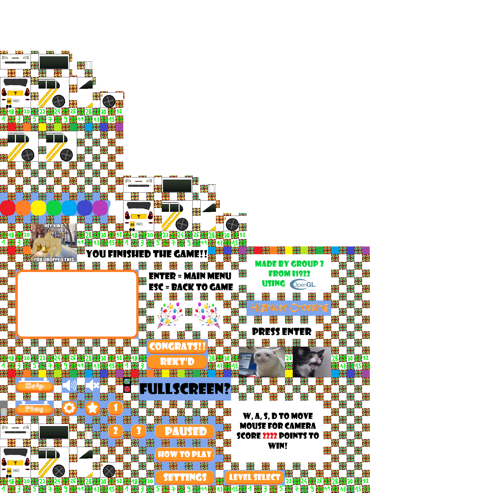

In this collaborative project, I worked with a team of three to design and develop a 3D car highway crossing game using C# and OpenGL. The primary objective of the game was to guide a car through multiple lanes of fast-moving highway traffic without crashing into obstacles. The game offered players a challenging and engaging experience with progressively more difficult levels as they navigated through increasingly congested highways and obstacle speed.

<video controls>
  <source src="demo.mp4" type="video/mp4">
  Your browser does not support the video tag.
</video>

My key responsibilities included rendering 3D objects and textures using OpenGL, ensuring smooth visual transitions and enhancing the overall appearance of the game world. We utilized OpenGL to model cars, roads, and other environmental elements, focusing on clear and functional visuals rather than realistic graphics. Additionally, I implemented audio effects to provide a more immersive experience for players, with sounds for engine revs, collisions, and background ambiance.

Throughout development, we collaborated closely, solving challenges such as optimizing object collisions, creating responsive controls, and synchronizing audio with gameplay. The project not only deepened my understanding of OpenGL and C#, but also honed my skills in teamwork, problem-solving, and game mechanics development.

Overall, this project demonstrated my ability to work in a team setting to create a fully functional 3D game, blending programming, 3D rendering, and audio design to deliver an engaging user experience.