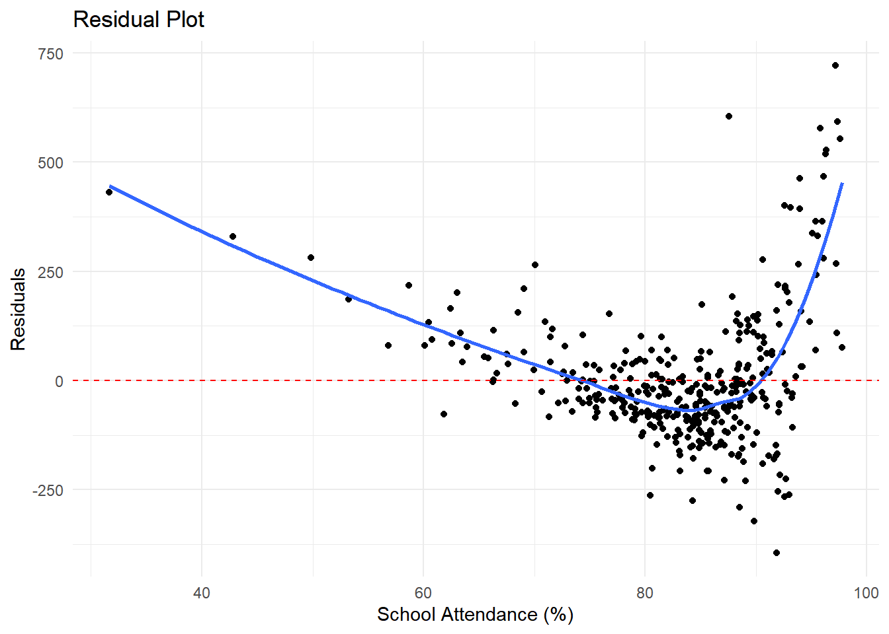

This analysis delves into the relationship between school attendance and SAT scores in New York high schools using data from 2010. The primary aim was to determine if higher attendance rates have a significant impact on students' SAT performance and to explore potential differences between SAT reading and writing scores.

The study utilized two datasets: the SAT College Board 2010 results, which included mean scores for reading, writing, and math, and daily attendance records from the NYC Department of Education. By applying regression analysis, the research investigated the correlation between the average SAT scores and school attendance rates. Additionally, hypothesis testing was used to determine if there were statistically significant differences between the SAT reading and writing scores.

Our findings are as follows:

- Impact of Attendance on SAT Scores: Our regression model revealed a positive relationship between school attendance and total SAT scores (sum of reading, writing, and math). The linear regression model predicted that a school with 100% attendance would have an average total SAT score of 1395.292. However, the residual plot suggested that the relationship may be non-linear, indicating that a quadratic model could better represent the data.

- Difference Between SAT Reading and Writing Scores: Through hypothesis testing, we found a significant difference between mean SAT reading and writing scores (p-value < 2.2e-16). The mean difference was about 6.54 points, with reading scores typically higher than writing scores. This suggests that improving reading scores does not necessarily result in equivalent gains in writing scores.

Our analysis supported the idea that increased attendance has a positive impact on SAT performance, though further research is needed to explore the non-linear relationship indicated by the residuals. This project honed my skills in R programming, regression analysis, and hypothesis testing, while providing an opportunity to collaborate on meaningful educational research.